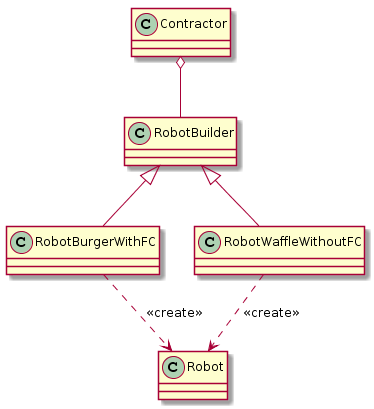

== Builder Pattern

Builder tasarım örüntüsünün temel hedefi, karmaşık bir nesneyi adım adım inşa etmektir. Builder tasarım örüntüsü genişletilebilirliği sağlamak ve kod karmaşıklığını engellemek için kullanılır. 

Projede builder tasarım örüntüsünün amacı robotun sensörlerine hakim olabilmektir. Ön kameraya sahip olan robotlar ile çarpışma kontrolü yapılabilmektedir. Çünkü robot, sadece robotun üstünde olan kamera ile bazı kör noktalara sahip olabilmektedir. Bu kör noktalar ise çarpışmaya sebebiyet verebilmektedir. Böylece robotun kamera ayarlarına göre kod ayarlanabilmektedir. Projenin builder pattern kullanım zorunluluğu yoktur.

.Sınıf Diyagramı

Projeye ait builder tasarım örüntüsünün sınıf diyagramı figür 1'de gösterilmiştir. Bu diyagramın uml kodu aşağıdaki gibidir.

[source,plantuml]
----
@startuml
Contractor o-- RobotBuilder
RobotBuilder <|-- RobotBurgerWithFC
RobotBuilder <|-- RobotWaffleWithoutFC
RobotBurgerWithFC ..> Robot: <<create>>
RobotWaffleWithoutFC ..> Robot: <<create>>
@enduml
----

.BuilderPattern.cpp
[source,c++]
----
#include "pch.h"
#include <string>
#include <iostream>

// Not: Buradan yararlanılmıştır: http://simplestcodings.blogspot.com.tr/2014/04/builder-design-pattern-implementation.html
using namespace std;

class Robot { <1>
private:
	string RobotType, CameraType, FrontCameraType;

public:
	void setRobotType(string RobotType)
	{
		this->RobotType = RobotType;
	}

	void setCameraType(string CameraType)
	{
		this->CameraType = CameraType;
	}

	void setFrontCameraType(string FrontCameraType)
	{
		this->FrontCameraType = FrontCameraType;
	}

	string RobottoString()
	{
		string features = "Robot Features :\n";
		features += "Robot Type : ";
		features += this->RobotType;
		features += "\n";
		features += "Camera Type : ";
		features += this->CameraType;
		features += "\n";
		features += "Front CameraT Type : ";
		features += this->FrontCameraType;
		features += "\n";
		return features;
	}
};

class RobotBuilder <2>
{
public:
	/* Abstract functions to build parts */
	virtual void buildRobotType() = 0;
	virtual void buildCameraType() = 0;
	virtual void builFrontCameraType() = 0;
	/* The product is returned by this function */
	virtual Robot* getRobot() = 0;
};

class RobotBurgerWithFC :public RobotBuilder { <3>
private:
	Robot *robot;
public:
	RobotBurgerWithFC()
	{
		robot = new Robot();
	}

	void buildRobotType()
	{
		robot->setRobotType("Burger");
	}

	void buildCameraType()
	{
		robot->setCameraType("LIDAR");
	}

	void builFrontCameraType()
	{
		robot->setFrontCameraType("NormalCamera");
	}

	Robot* getRobot()
	{
		return this->robot;
	}
};

class RobotWaffleWithoutFC :public RobotBuilder { <4>
private:
	Robot *robot;
public:
	RobotWaffleWithoutFC()
	{
		robot = new Robot();
	}

	void buildRobotType()
	{
		robot->setRobotType("Waffle");
	}

	void buildCameraType()
	{
		robot->setCameraType("LIDAR");
	}

	void builFrontCameraType()
	{
		robot->setFrontCameraType("None");
	}

	Robot* getRobot()
	{
		return this->robot;
	}
};

class Contractor <5>
{
private:
	RobotBuilder *robotBuilder;

public:
	Contractor(RobotBuilder *robotBuilder)
	{
		this->robotBuilder = robotBuilder;
	}

	Robot *getRobot()
	{
		return robotBuilder->getRobot();
	}

	void buildRobot()
	{
		robotBuilder->buildRobotType();
		robotBuilder->buildCameraType();
		robotBuilder->builFrontCameraType();
	}
};

int main()
{
	RobotBuilder *burgerwithfrontcamera = new RobotBurgerWithFC();
	RobotBuilder *wafflewithfrontcamera = new RobotWaffleWithoutFC();

	Contractor *ctr1 = new Contractor(burgerwithfrontcamera);
	Contractor *ctr2 = new Contractor(wafflewithfrontcamera);

	ctr1->buildRobot();
	Robot *r1 = ctr1->getRobot();

	cout << "Robot 1 : \n";
	cout << "Constructed: " << r1 << "\n";
	cout << r1->RobottoString();

	cout << "-------------------------------------------------------\n";

	ctr2->buildRobot();
	Robot *r2 = ctr2->getRobot();
	cout << "Robot 2 : \n";
	cout << "Constructed: " << r2 << "\n";
	cout << r2->RobottoString();

	getchar();
}

----
<1> Donecek olan urun
<2> Builder sinif
<3> RobotBuilder arayuzunun Concrete sinifi
<4> RobotBuilder arayuzunun baska bir Concrete sinifi
<5> Director veya Client denebilir. Robotu insa eder