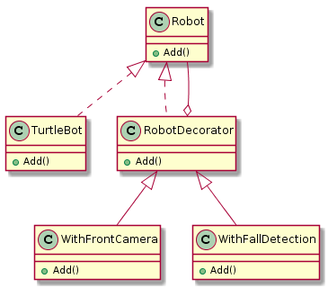

== Decorator Pattern

Decoractor tasarım deseni; yapıya yeni metot eklenmesini yapının arayüzünü uygulayan bir decorator nesnesi tanımlanarak yapar. İçinde uyguladığı arayüz
tipinde bir referans barındırır ve kendisine verilen bu nesne üzerinde yeni eklenecek olan metotları barındırır. Kullanımı oldukça basittir.
  
 
Random Rapidly Tree kullanarak yapılacak yol planlama projesinde decoractor kalıbı ile kullanılacak olan robotun sensör eklemeleri yapılacaktır.

Projenin decoractor pattern zorunluluğu yoktur.

.Sınıf diyagramı

.Sınıf diyagramının plantuml kodu
[source,plantuml]
----
@startuml

class Robot{
  +Add()
}

class TurtleBot{
  +Add()
}

class RobotDecorator{
  +Add()
}

class WithFrontCamera{
  +Add()
}

class WithFallDetection{
  +Add()
}

RobotDecorator <|-- WithFrontCamera
RobotDecorator <|-- WithFallDetection 
Robot <|.. RobotDecorator 
Robot <|.. TurtleBot
Robot --o RobotDecorator
@enduml
----

.DecoratorPattern.cpp
[source,c++]
----
#include "pch.h"
#include <iostream>

class Robot <1>
{
public:
	virtual void Add() = 0;
	virtual ~Robot()
	{ 
		std::cout << "delete Robot";
	}
};

class TurtleBot : public Robot <2>
{
public:
	virtual void Add()
	{
		std::cout << "\n TurtleBot";
	}
};

class RobotDecorator : public Robot <3>
{
public:
	RobotDecorator(Robot& decorator) :m_Decorator(decorator){}
	virtual void Make()
	{
		m_Decorator.Add();
	}
private:
	Robot& m_Decorator;
};

class WithFrontCamera : public RobotDecorator <4>
{
public:
	WithFrontCamera(Robot& decorator) :RobotDecorator(decorator){}
	virtual void Add()
	{
		RobotDecorator::Make();
		std::cout << " + FrontCamera";
	}
	virtual ~WithFrontCamera()
	{
		std::cout << "delete FrontCamera";
	}
};

class WithFallDetection : public RobotDecorator <5>
{
public:
	WithFallDetection(Robot& decorator) :RobotDecorator(decorator){}
	virtual void Add()
	{
		RobotDecorator::Make();
		std::cout << " + FallDetection";
	}
	virtual ~WithFallDetection()
	{
		std::cout << "delete FallDetection";
	}
};

int main()
{
	Robot* pTurtleBot = new TurtleBot();
	pTurtleBot->Add();

	Robot* pTurtleBotWithFrontCamera = new WithFrontCamera(*pTurtleBot);
	pTurtleBotWithFrontCamera->Add();

	Robot* pTurtleBotWithFrontCameraAndFallDetection = new WithFallDetection(*pTurtleBotWithFrontCamera);
	pTurtleBotWithFrontCameraAndFallDetection->Add();

	std::cout << "\n----------------------Del pTurtleBot----------------------\n";

	delete pTurtleBot;
	std::cout << "\n---------------Del pTurtleBotWithFrontCamera---------------\n";
	delete pTurtleBotWithFrontCamera;
	std::cout << "\n-------Del pTurtleBotWithFrontCameraAndFallDetection-------\n";
	delete pTurtleBotWithFrontCameraAndFallDetection;

	return 0;
}
----
<1> Temel bir robot yaratır ve ardından dilediğiniz gibi sensör eklersiniz. Eklenen sensörler, temel robotun yapısını değiştirir.
<2>  Robotu gösteren bir arayüzdür. Dekoratörlerin ekleneceği temel sınıftır.
<3> Dekoratör sınıfıdır. Dekoratör tasarım modelinin çekirdeğidir. Arabirim türü için bir öznitelik içerir. 
<4> Dekoratördür, soyut dekoratörü uygulayan sınıftır. Dekoratör oluşturulduğunda, temel örnek yapıcı kullanılarak geçirilir ve süper sınıfa atanır. İstenen özellik eklenir.
<5> Dekoratördür ve 4. ile aynıdır. Farklı bir özellik eklemek için kullanılır.

