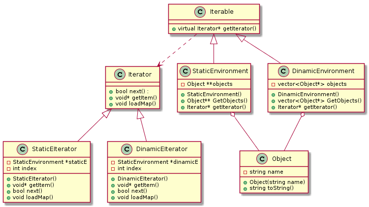

== Iterator Pattern

Iterator (tekrarlayıcı) tasarım deseni, davranışsal grubununa ait, nesne koleksyonlarının (list,array,queue) elemanlarını belirlenen kurallara göre elde edilmesini düzenleyen tasarım desenidir. Iterator tasarım deseni ile koleksiyon yapısı bilinmesine ihtiyaç olmadan koleksiyon elemanları üzerinde işlem yapılabilmesini sağlar. 
 
Random Rapidly Tree kullanarak yapılacak yol planlama projesinde iterator kalıbı ile haritaya nesne eklemesi ve o nesnelerin okunması sağlanacaktır.

Projenin object pooling pattern zorunluluğu yoktur.

.Sınıf diyagramı

.Sınıf diyagramının plantuml kodu
[source,plantuml]
----
@startuml

class Iterator {
 +bool next() : 
 +void* getItem()
 +void loadMap()
}
class Iterable {
 +virtual Iterator* getIterator()
}
class Object {
 -string name
 +Object(string name)
 +string toString()
}
class StaticEnvironment {
 -Object **objects
 +StaticEnvironment()
 +Object** GetObjects()
 +Iterator* getIterator()
}
class DinamicEnvironment {
 -vector<Object*> objects
 +DinamicEnvironment()
 +vector<Object*> GetObjects()
 +Iterator* getIterator()
}
class StaticEIterator {
 -StaticEnvironment *staticE
 -int index
 +StaticEIterator()
 +void* getItem()
 +bool next()
 +void loadMap()
}
class DinamicEIterator {
 -StaticEnvironment *dinamicE
 -int index
 +DinamicEIterator()
 +void* getItem()
 +bool next()
 +void loadMap()
}

Iterable <|-- StaticEnvironment
Iterable <|-- DinamicEnvironment

StaticEnvironment o-- Object
DinamicEnvironment o-- Object

Iterator <|-- StaticEIterator
Iterator <|-- DinamicEIterator
Iterable ..> Iterator

@enduml
----

.IteratorPattern.cpp
[source,c++]
----
#include <iostream>
#include <vector>
#include <string>

class Iterator { <1>
public:
	virtual bool next() = 0;
	virtual void* getItem() = 0;
	virtual void loadMap() = 0;
};

class Iterable { <2>
public:
	virtual Iterator* getIterator() = 0;
};

class Object { <3>
private:
	std::string name;
public:
	Object(std::string name) {
		this->name = name;
	}
	std::string toString() {
		return this->name;
	}
};
class StaticEnvironment : public Iterable { <4>
private:
	Object **objects;
public:
	StaticEnvironment() {
		objects = new Object*[3];
		objects[0] = new Object("bookshelf");
		objects[1] = new Object("chair");
		objects[2] = new Object("desk");
	}
	Object** GetObjects() {
		return objects;
	}
	Iterator* getIterator();
};

class DinamicEnvironment : public Iterable { <5>
private:
	std::vector<Object*> objects;
public:
	DinamicEnvironment() {
		objects = std::vector<Object*>();
		objects.push_back(new Object("person"));
		objects.push_back(new Object("dog"));
		objects.push_back(new Object("cat"));
	}

	std::vector<Object*> GetObjects() {
		return objects;
	}
	Iterator* getIterator();
};

class StaticEIterator : public Iterator { <6>
private:
	StaticEnvironment *staticE;
	int index;
public:
	StaticEIterator() {
		staticE = new StaticEnvironment();
	}
	void* getItem() {
		Object **c = &(staticE->GetObjects()[index]);
		++index;
		return *c;
	}
	bool next() {
		if (index < 3) {
			return true;
		}
		else {
			return false;
		}
	}
	void loadMap() {
		std::cout << "static map" << std::endl;
	}

};

class DinamicEIterator : public Iterator { <7>
private:
	DinamicEnvironment *dinamicE;
	int index;
public:
	DinamicEIterator() {
		dinamicE = new DinamicEnvironment();
	}
	void *getItem() {
		Object *c = dinamicE->GetObjects()[index];
		++index;
		return c;
	}
	bool next() {
		if (index < (int)dinamicE->GetObjects().size()) {
			return true;
		}
		else {
			return false;
		}
	}
	void loadMap() {
		std::cout << "dinamic map" << std::endl;
	}
};

Iterator* DinamicEnvironment::getIterator()
{
	return new DinamicEIterator();
}

Iterator* StaticEnvironment::getIterator()
{
	return new StaticEIterator();
}

int main()
{
	DinamicEnvironment *de = new DinamicEnvironment();
	Iterator *itr = de->getIterator();
	itr->loadMap();
	while (itr->next()) {
		Object *t = (Object*)itr->getItem();
		std::cout << t->toString() << std::endl;
	}
	StaticEnvironment *se = new StaticEnvironment();
	itr = se->getIterator();
	itr->loadMap();
	while (itr->next()) {
		Object *t = (Object*)itr->getItem();
		std::cout << t->toString() << std::endl;
	}
	getchar();
}

----
<1> Iterator sınıfı
<2> Iterator yapılabilen sınıf
<3> Nesnelerin özelliklerinin bulunduğu sınıf
<4> Statik nesneleri içeren ve iterable sınıfından türetilen sınıf 
<5> Dinamik nesneleri içeren ve iterable sınıfından türetilen sınıf 
<6> Statik ortamın iterator sınıfı ve iterator sınıfından türetilen sınıf 
<7> Dinamik ortamın iterator sınıfı ve iterator sınıfından türetilen sınıf 