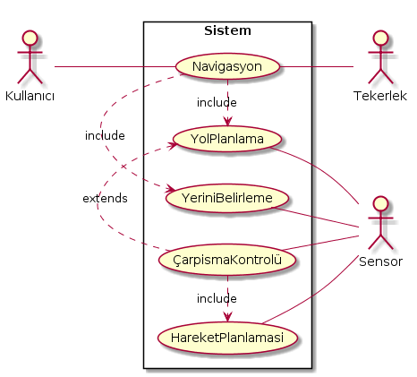

==== Use Case

Oluşturulan ilk kullanım durumu diyagramında temel gereksinimler belirlenir.

|=======================
|*Özet* | Kullanıcı komutu girdiğinde robot programlandığı şekilde hareket tmeye başlar.
|*Aktörler* | Kullanıcı,Sensör, Tekerlek  
|*Önkoşul* | Robot fiziksel olarak hareket etmeye hazır olmalı herhangi bir engeli bulunmamalı.(donanım araızası vs) 
|*Açıklama* | 1. Use Case, kullanıcı bir hedef girdiğinde başlar.

2. Sistem (Navigasyon), hedefe giden en uygun yolu hesaplar.

3. Sistem(Navigasyon), tekerlek aktörüne varış noktasına hareket etmeye başlaması talimatını verir.

4. Tekerlek aktörü, sisteme hareket etmeye başladığını bildirir.

5. Sistem periyodik olarak sensör verilerini okur ve mevcut pozisyonu hesaplar.

6. Sistem hedefe ulaştığını tespit eder ve tekerleğe durması talimatını verir.

7. Tekerlek, sisteme hareket etmeyi durdurduğunu ve kullanım durumunun bittiğini bildirir.
|=======================

*V1.0*

----
@startuml
left to right direction
skinparam packageStyle rectangle
actor KullaniciArayuzu
actor Sensor
actor Tekerlek
rectangle Sistem{
   Sensor -- (ÇarpismaKontrolü)
   KullaniciArayuzu -- (Navigasyon)
   (Navigasyon) .> (YolPlanlama) : include
   (YolPlanlama) .> (ÇarpismaKontrolü) : extends
   (Navigasyon) -- Tekerlek
}
@enduml
----

*V2.0*

İlk oluşturulan kullanım durum diyagramına ek olarak bazı özellikler eklenir:

* Yol planlama işlemine ek bir özellik olarak Çarpışma kontrolü eklenir. Bu sayede planlanan yol üzerinde *yalnızca o an için* bir yol planlaması yapılır. Bu şekilde dinamik bir ortamda etkili bir yöntem olmayacaktır.
Bu yüzden Çarpışma Kontrolü işleminin hareket planlaması da yapması gerekir ki engel çıktığı durumda bir sonraki olası hareketler planlansın.

*V2.0*

----
@startuml
left to right direction
skinparam packageStyle rectangle
actor KullaniciArayuzu
actor Sensor
actor Tekerlek
rectangle Sistem{
   Sensor -- (YeriniBelirleme)
   Sensor -- (ÇarpismaKontrolü)
   Sensor -- (HareketPlanlamasi)
   KullaniciArayuzu -- (Navigasyon)
   (Navigasyon) .> (YolPlanlama) : include
   (YolPlanlama) .> (ÇarpismaKontrolü) : extends
   (ÇarpismaKontrolü) .> (HareketPlanlamasi) : include
   (Navigasyon) -- Tekerlek
   (Navigasyon) .> (YeriniBelirleme) : include
}
@enduml
----

*V3.0* 

İkinci versiyona ek olarak, Yerini Belirleme işlemine harita özelliği eklenir. Robot konumunu tespit ettiği her durumda haritayı güncelleştirir.

*V3.0*

----
@startuml
left to right direction
skinparam packageStyle rectangle
actor KullaniciArayuzu
actor Sensor
actor Tekerlek
rectangle Sistem{
   Sensor -- (YeriniBelirleme)
   Sensor -- (ÇarpismaKontrolü)
   Sensor -- (HareketPlanlamasi)
   KullaniciArayuzu -- (Navigasyon)
   (Navigasyon) .> (YolPlanlama) : include
   (YolPlanlama) .> (ÇarpismaKontrolü) : extends
   (ÇarpismaKontrolü) .> (HareketPlanlamasi) : include
   (Navigasyon) -- Tekerlek
   (YeriniBelirleme) .> (HaritaGüncellemek) : include
   (HaritaGüncellemek) .> (HaritayiGörsellestir) : extends
   (Navigasyon) .up.> (YeriniBelirleme) : include
   (YeriniBelirleme) .> (HedefKontrolü) : include
   (HedefKontrolü) .> (SesliBildirim) : extends
}
@enduml
----
